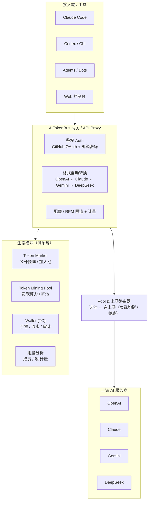

# AITokenBus 产品拆解报告

> - 分析对象：AITokenBus
> - 分析时间：2026-07-24
> - 分析方法：落地页抓取 + 前端打包文件（Vite/React SPA，`/assets/index-*.js`）静态分析
> - 说明：代理与路由核心逻辑位于后端，前端仅将请求发往 `/v1/*` 端点，由服务端完成选池、选上游、格式转换、限流与计费。

## 目录

- [一、产品定位](#一产品定位)
- [二、系统架构](#二系统架构)
- [三、功能模块分解](#三功能模块分解)
- [四、核心请求链路逻辑](#四核心请求链路逻辑)
- [五、挖矿机制解读（平台差异化设定）](#五挖矿机制解读平台差异化设定)
- [六、技术栈与架构](#六技术栈与架构)
- [七、商业模式与风险提示](#七商业模式与风险提示)
- [八、附录：关键路由 / API 清单](#八附录关键路由--api-清单)

---

## 一、产品定位

AITokenBus 是一个「AI Token 共享 / 转售网关平台」。它把个人或团队的多个 AI 服务商订阅（OpenAI、Claude、Gemini、DeepSeek）聚合成「池（Pool）」，成员加入后获得自己独立的派生 API Key，通过平台提供的 OpenAI / Anthropic / Gemini 兼容端点统一调用。平台在中间层完成：

- 多 provider 的**格式自动转换**；
- 池内多上游的**负载路由 / 兜底**；
- 每成员的**配额与 RPM 限流**；
- 按 token、请求数、成本的**计量与计费**；
- 配套 **Token 市场、挖矿矿池、积分钱包**，形成供给侧与消费侧闭环。

一句话：**用「共享算力 + 挖矿得币」的叙事，撮合「有 AI 订阅额度的人」与「需要便宜 / 统一接入的人」**。

## 二、系统架构

## 三、功能模块分解

| 模块 | 前端路由 | 对应后端 API | 作用 |
|------|----------|--------------|------|
| 营销落地 | `/` | — | SHARE · EXCHANGE · CONTRIBUTE 叙事 |
| 认证 | `/login` `/register` `/auth/github`(+callback/bind/unbind) `/auth/password` `/auth/me` `/auth/profile` | `/api/auth/*` | 邮箱密码 + GitHub OAuth |
| 池管理 | `/create-pool` `/pools/created` `/pools/joined` `/pools/join` `/pools/my-requests` | `/api/pools/*` | 建池、配上游、审批入池申请 |
| Token 市场 | `/market` `/market/listings` | `/api/market/*` | 公开挂牌、浏览并加入他人池 |
| 我的 / 矿池 | `/mine` `/mine/pools` `/mine/miners` `/mine/miner-keys` `/mine/my-mines` `/mine/free-llm` `/mine/llm` `/mine/vendors` `/mine/paid-vendors` `/mine/types` | `/api/mine/*` | 生成 Key、管理矿机、查看可用模型 |
| 钱包 | `/wallet` `/wallet/account` | `/api/wallet/*` | TC 余额、流水、消费审计 |
| 其他 | `/dashboard` `/profile` `/community` `/routes/available-pools` `/free-llm` | `/api/routes/*` | 概览、社交、可用池路由 |

## 四、核心请求链路逻辑

1. **建池（Create Pool）**：创建者填入上游配置——provider、Base URL、API Key、allowed models，并设置配额 / RPM，存为 `Upstream Service`。
2. **入池（Join Pool）**：好友分享链接或市场挂牌 → 申请 → 创建者 / 池审批 → 成员获得访问权。
3. **成员拿 Key**：成员在 `/mine/miner-keys` 生成自己的 API Key（创建者看不到成员 Key），配置进 Claude Code / Codex 等工具。
4. **代理转发（Proxy）**：工具把请求打到平台兼容端点 `/v1/chat/completions`、`/v1/messages`、`/v1/models`、`/v1beta/models`、`/v1/responses`。
5. **格式自动转换**：平台将任意工具的请求格式翻译为目标上游格式（OpenAI ↔ Claude ↔ Gemini ↔ DeepSeek），响应再翻回工具期望格式（代码中 `transform` / `translate` / `convert` 系列函数）。
6. **选池 / 选上游路由**：根据 Key 归属定位所属池，再在池内多个 Upstream 间做负载均衡 / 兜底，转发到真实服务商。
7. **限流与计量**：每成员 `quota` + `rpm_limit` 限流；按 token、请求数、成本做 per-member / per-pool 统计。

## 五、挖矿机制解读（平台差异化设定）

代码高频出现 `miner` / `mining` / `GPU` / `earn` / `TC Wallet`，这是最特殊的部分：

- **Token Mining Pool**：用户可成为「矿工（miner）」贡献自有上游算力（代码含 `minerGpuInfo`，疑似上报 GPU 信息），建立一个「矿（mine）」，其他成员使用即产生消耗，矿工赚取 **TC 积分**。
- `createFreeMineToEarn`：可创建「免费 LLM 矿」来赚取。
- 平台运营**官方矿池**（`officialPoolBadge`）+ 开放**市场矿池**（`market_status` 开关）。
- 钱包赚币引导（`wallet.earnGuide`）明确三种赚 TC 方式：**官方矿池 / Token Market / 矿池**。
- **本质**：用「贡献算力得币」叙事激励用户把自有 AI 订阅额度注入平台网络（供给侧），币用于抵扣平台内消费或（推测）流转。
- **矿工客户端**：需本地运行一个 miner 客户端（心跳 `/api/mine/heartbeat` + 任务轮询 `/api/mine/tasks/poll`）接入矿池。

## 六、技术栈与架构

- **前端**：React + Vite + React Router（SPA），i18n 支持 `en` / `zh-CN` / `zh-TW`，本地主题切换（localStorage `theme` dark/light）。
- **鉴权**：邮箱密码 + GitHub OAuth（`/api/auth/github` 系列）。
- **网关**：暴露标准 LLM 端点（OpenAI `/v1/chat/completions`、`/v1/responses`；Anthropic `/v1/messages`；Gemini `/v1beta/models`），真正的路由 / 转换 / 计量 / 计费在后端。
- **后端 API**：RESTful `/api/*`，含 auth / mine / wallet / market / pools / routes 等。
- **矿工客户端**：本地 daemon，心跳 + 任务轮询接入矿池。

## 七、商业模式与风险提示

**模式**：撮合「有 AI 订阅额度的人」与「需要便宜 / 统一接入的人」，靠币经济循环或抽成。

**需警惕**：
1. 多用户共享同一上游 API Key 通常违反 OpenAI / Anthropic 等服务商 **ToS（禁止转售 / 共享凭证）**；
2. 「挖矿得币」带有积分盘特征，注意资金与合规风险；
3. 上游 Key 交给平台代理，存在凭证暴露与滥用风险（虽声称成员 Key 对创建者不可见，但平台侧掌握上游 Key）。

## 八、附录：关键路由 / API 清单

**前端路由（React Router）**：
`/login` `/register` `/create-pool` `/pools/{created,joined,join,my-requests}` `/market` `/market/listings` `/mine` `/mine/{pools,miners,miner-keys,my-mines,available-models,free-llm,llm,vendors,paid-vendors,types}` `/wallet` `/wallet/account` `/dashboard` `/profile` `/community` `/routes/available-pools` `/free-llm`

**网关兼容端点（代理）**：
`/v1/chat/completions` `/v1/messages` `/v1/models` `/v1/responses` `/v1beta/models`

**后端 API（已确认存在）**：
- `/api/auth/*`：github 系列、password、me、profile
- `/api/mine/*`：pools / miners / miner-keys / my-mines / available-models / free-llm / llm / vendors / paid-vendors / types / heartbeat / tasks/poll
- `/api/wallet/*`：account / transactions / consumption-logs / consumption-stats
- `/api/market/*` `/api/pools/*` `/api/routes/*`

---

*本报告基于公开页面与前端静态资源的非侵入式分析，未对后端接口进行实际调用。*
