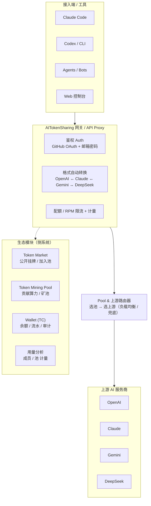
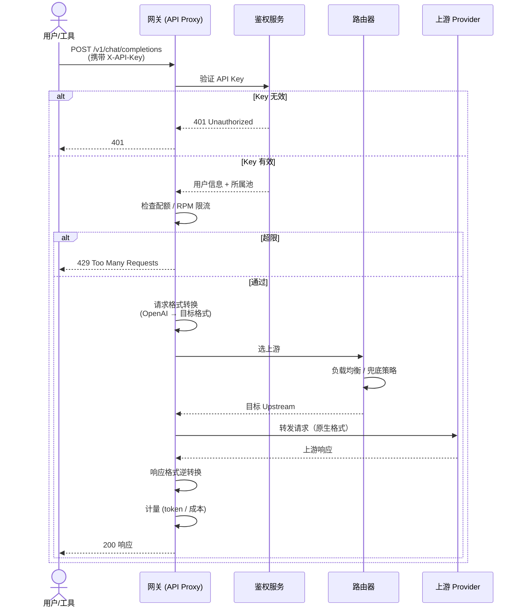
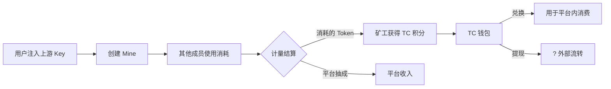

# AITokenSharing 产品分析

> - 分析对象：AITokenSharing
> - 分析时间：2026-07-24
> - 分析方法：落地页抓取 + 前端打包文件（Vite/React SPA，`/assets/index-*.js`）静态分析
> - 说明：代理与路由核心逻辑位于后端，前端仅将请求发往 `/v1/*` 端点，由服务端完成选池、选上游、格式转换、限流与计费。

## 目录

- [一、产品定位](#一产品定位)
- [二、系统架构](#二系统架构)
- [三、功能模块分解](#三功能模块分解)
- [四、核心请求链路逻辑](#四核心请求链路逻辑)
- [五、挖矿机制解读（平台差异化设定）](#五挖矿机制解读平台差异化设定)
- [六、技术栈与架构](#六技术栈与架构)
- [七、商业模式与风险提示](#七商业模式与风险提示)
- [八、安全深度分析](#八安全深度分析)
- [九、竞品横向对比](#九竞品横向对比)
- [十、挖矿经济模型量化](#十挖矿经济模型量化)
- [十一、API 调用示例](#十一api-调用示例)
- [十二、复现方法](#十二复现方法)
- [十三、附录：关键路由 / API 清单](#十三附录关键路由--api-清单)

---

## 一、产品定位

AITokenSharing 是一个「AI Token 共享 / 转售网关平台」。它把个人或团队的多个 AI 服务商订阅（OpenAI、Claude、Gemini、DeepSeek）聚合成「池（Pool）」，成员加入后获得自己独立的派生 API Key，通过平台提供的 OpenAI / Anthropic / Gemini 兼容端点统一调用。平台在中间层完成：

- 多 provider 的**格式自动转换**；
- 池内多上游的**负载路由 / 兜底**；
- 每成员的**配额与 RPM 限流**；
- 按 token、请求数、成本的**计量与计费**；
- 配套 **Token 市场、挖矿矿池、积分钱包**，形成供给侧与消费侧闭环。

一句话：**用「共享算力 + 挖矿得币」的叙事，撮合「有 AI 订阅额度的人」与「需要便宜 / 统一接入的人」**。

## 二、系统架构



## 三、功能模块分解

| 模块 | 前端路由 | 对应后端 API | 作用 |
|------|----------|--------------|------|
| 营销落地 | `/` | — | SHARE · EXCHANGE · CONTRIBUTE 叙事 |
| 认证 | `/login` `/register` `/auth/github`(+callback/bind/unbind) `/auth/password` `/auth/me` `/auth/profile` | `/api/auth/*` | 邮箱密码 + GitHub OAuth |
| 池管理 | `/create-pool` `/pools/created` `/pools/joined` `/pools/join` `/pools/my-requests` | `/api/pools/*` | 建池、配上游、审批入池申请 |
| Token 市场 | `/market` `/market/listings` | `/api/market/*` | 公开挂牌、浏览并加入他人池 |
| 我的 / 矿池 | `/mine` `/mine/pools` `/mine/miners` `/mine/miner-keys` `/mine/my-mines` `/mine/free-llm` `/mine/llm` `/mine/vendors` `/mine/paid-vendors` `/mine/types` | `/api/mine/*` | 生成 Key、管理矿机、查看可用模型 |
| 钱包 | `/wallet` `/wallet/account` | `/api/wallet/*` | TC 余额、流水、消费审计 |
| 其他 | `/dashboard` `/profile` `/community` `/routes/available-pools` `/free-llm` | `/api/routes/*` | 概览、社交、可用池路由 |

## 四、核心请求链路逻辑

1. **建池（Create Pool）**：创建者填入上游配置——provider、Base URL、API Key、allowed models，并设置配额 / RPM，存为 `Upstream Service`。
2. **入池（Join Pool）**：好友分享链接或市场挂牌 → 申请 → 创建者 / 池审批 → 成员获得访问权。
3. **成员拿 Key**：成员在 `/mine/miner-keys` 生成自己的 API Key（创建者看不到成员 Key），配置进 Claude Code / Codex 等工具。
4. **代理转发（Proxy）**：工具把请求打到平台兼容端点 `/v1/chat/completions`、`/v1/messages`、`/v1/models`、`/v1beta/models`、`/v1/responses`。
5. **格式自动转换**：平台将任意工具的请求格式翻译为目标上游格式（OpenAI ↔ Claude ↔ Gemini ↔ DeepSeek），响应再翻回工具期望格式（代码中 `transform` / `translate` / `convert` 系列函数）。
6. **选池 / 选上游路由**：根据 Key 归属定位所属池，再在池内多个 Upstream 间做负载均衡 / 兜底，转发到真实服务商。
7. **限流与计量**：每成员 `quota` + `rpm_limit` 限流；按 token、请求数、成本做 per-member / per-pool 统计。

### 请求链路时序图



## 五、挖矿机制解读（平台差异化设定）

代码高频出现 `miner` / `mining` / `GPU` / `earn` / `TC Wallet`，这是最特殊的部分：

- **Token Mining Pool**：用户可成为「矿工（miner）」贡献自有上游算力（代码含 `minerGpuInfo`，疑似上报 GPU 信息），建立一个「矿（mine）」，其他成员使用即产生消耗，矿工赚取 **TC 积分**。
- `createFreeMineToEarn`：可创建「免费 LLM 矿」来赚取。
- 平台运营**官方矿池**（`officialPoolBadge`）+ 开放**市场矿池**（`market_status` 开关）。
- 钱包赚币引导（`wallet.earnGuide`）明确三种赚 TC 方式：**官方矿池 / Token Market / 矿池**。
- **本质**：用「贡献算力得币」叙事激励用户把自有 AI 订阅额度注入平台网络（供给侧），币用于抵扣平台内消费或（推测）流转。
- **矿工客户端**：需本地运行一个 miner 客户端（心跳 `/api/mine/heartbeat` + 任务轮询 `/api/mine/tasks/poll`）接入矿池。

## 六、技术栈与架构

- **前端**：React + Vite + React Router（SPA），i18n 支持 `en` / `zh-CN` / `zh-TW`，本地主题切换（localStorage `theme` dark/light）。
- **鉴权**：邮箱密码 + GitHub OAuth（`/api/auth/github` 系列）。
- **网关**：暴露标准 LLM 端点（OpenAI `/v1/chat/completions`、`/v1/responses`；Anthropic `/v1/messages`；Gemini `/v1beta/models`），真正的路由 / 转换 / 计量 / 计费在后端。
- **后端 API**：RESTful `/api/*`，含 auth / mine / wallet / market / pools / routes 等。
- **矿工客户端**：本地 daemon，心跳 + 任务轮询接入矿池。

## 七、商业模式与风险提示

**模式**：撮合「有 AI 订阅额度的人」与「需要便宜 / 统一接入的人」，靠币经济循环或抽成。

**需警惕**：
1. 多用户共享同一上游 API Key 通常违反 OpenAI / Anthropic 等服务商 **ToS（禁止转售 / 共享凭证）**；
2. 「挖矿得币」带有积分盘特征，注意资金与合规风险；
3. 上游 Key 交给平台代理，存在凭证暴露与滥用风险（虽声称成员 Key 对创建者不可见，但平台侧掌握上游 Key）。

## 八、安全深度分析

### 8.1 攻击面梳理

| 攻击面 | 风险等级 | 描述 |
|--------|----------|------|
| API Key 传输 | 🔴 高 | 用户 Key 通过 HTTP Header 传输，若未强制 HTTPS 则存在中间人窃听风险 |
| 上游凭证存储 | 🔴 高 | 创建者将上游 API Key 明文提交至平台，平台服务端数据库成为高价值攻击目标 |
| 格式转换注入 | 🟡 中 | 请求/响应格式转换过程中可能存在 prompt 注入或内容篡改窗口 |
| 矿工客户端 | 🟡 中 | 本地 daemon 心跳 + 任务轮询，若通信未加密可被劫持或伪造 |
| 跨池数据隔离 | 🟡 中 | 多租户共享网关，若路由鉴权逻辑存在缺陷可能导致跨池数据泄露 |
| OAuth 令牌 | 🟡 中 | GitHub OAuth 回调若未校验 state 参数，存在 CSRF 风险 |
| 前端 XSS | 🟢 低 | React SPA 默认使用 JSX 转义，但需关注 `dangerouslySetInnerHTML` 和第三方依赖 |

### 8.2 凭证管理风险

```
用户 → 创建者（提交上游 Key）
创建者 → 平台（上游 Key 明文存储于平台数据库）
成员 → 平台（派生 Key 由平台生成并持有）
平台 → 上游 Provider（使用存储的上游 Key 发起请求）
```

**关键问题：**
- 平台掌握了所有用户的原始上游 API Key，成为单点凭证泄露源
- 派生 Key 虽对创建者不可见，但平台自身可以关联成员 Key ↔ 上游 Key
- 不存在端到端加密或零知识证明机制来保护用户凭证

### 8.3 合规风险矩阵

| 服务商 | 禁止行为条款 | 本平台行为 | 合规判定 |
|--------|-------------|-----------|----------|
| OpenAI | 禁止转售、共享 API 凭证 | 创建者共享 Key 给多成员使用 | ❌ 违反 |
| Anthropic | 禁止再许可、转售访问权限 | 派生 Key 供第三方使用 | ❌ 违反 |
| Google Gemini | 禁止未授权分发 API 访问 | Pool 内成员共享上游额度 | ❌ 违反 |
| DeepSeek | 禁止商业转售 API 访问 | 矿池激励 + 市场挂牌 | ❌ 违反 |

### 8.4 建议的安全加固方向

1. **凭证加密存储**：上游 Key 使用用户持有的密钥进行客户端加密后再上传，平台无法解密
2. **审计日志**：提供 per-member / per-request 的完整审计追踪
3. **速率限制绕过防护**：防止单用户通过多 Key 绕过 RPM 限制
4. **WAF / API Gateway**：在前端网关层添加请求内容过滤，防止 prompt 注入扩散

## 九、竞品横向对比

### 9.1 同类平台概览

| 维度 | AITokenSharing | LiteLLM | One API | AIHubMix | openai-forward |
|------|-----------|---------|---------|----------|----------------|
| **定位** | Token 共享 + 矿池经济 | 企业级 LLM 网关 | 多模型接入管理 | 模型聚合 + 分销 | 轻量级转发代理 |
| **开源** | 闭源 SaaS | ✅ MIT | ✅ MIT | 闭源 SaaS | ✅ MIT |
| **格式转换** | ✅ OpenAI↔Claude↔Gemini↔DeepSeek | ✅ 100+ 模型 | ✅ 基础转换 | ✅ 主流模型 | ✅ OpenAI 兼容 |
| **多租户/池** | ✅ Pool 机制 | ✅ Virtual Keys | ✅ 渠道分组 | ✅ 团队空间 | ❌ |
| **挖矿/积分** | ✅ TC 积分 + 矿池 | ❌ | ❌ | ❌ | ❌ |
| **Token 市场** | ✅ 公开挂牌 | ❌ | ❌ | ❌ | ❌ |
| **本地部署** | ❌（SaaS only） | ✅ Docker | ✅ Docker | ❌ | ✅ pip/Docker |
| **计费/计量** | ✅ token/请求/成本 | ✅ Spend Tracking | ✅ 用量统计 | ✅ 充值计费 | ❌ |
| **多语言** | ✅ en/zh-CN/zh-TW | ✅ | ✅ | 中文 | ❌ |

### 9.2 AITokenSharing 的差异化特征

1. **唯一引入「挖矿」叙事的平台** — 通过 TC 积分和矿池机制激励供给侧
2. **市场化的 Token 流通** — 公开挂牌机制让供给与需求在平台内自由匹配
3. **纯 SaaS 模式** — 不自部署，所有流量经过平台中转，数据集中度高
4. **C 端友好** — 相比 LiteLLM 等面向开发者的产品，AITokenSharing 更偏向终端用户

### 9.3 竞争力评估

| 优势 | 劣势 |
|------|------|
| 挖矿积分降低用户付费门槛 | ToS 合规风险是生存性威胁 |
| Token 市场形成供需闭环 | 闭源 + 中心化，用户无自主可控能力 |
| 全协议格式转换覆盖面广 | 缺乏企业级 SLA 和私有化部署选项 |
| 多语言 + 低门槛用户体验 | 竞品 LiteLLM 开源生态更成熟 |

## 十、挖矿经济模型量化

### 10.1 模型推演（基于前端代码提取的参数）



### 10.2 关键参数估算

| 参数 | 推测值 | 依据 |
|------|--------|------|
| TC 积分计算基准 | `TC = f(token_count, model_price)` | 代码中出现按 token + 成本的双维计量 |
| 平台抽成比例 | 未知（无前端明文字段） | 需抓取实际 API 响应或分析后端 |
| 矿工收益分成 | 未知 | 可能在矿池合约中定义 |
| 免费矿(Freemine) | `createFreeMineToEarn` 存在 | 可能有每日/每月免费额度门槛 |
| RPM 限制 | per-pool configurable | 前端建池表单含 `rpm_limit` 字段 |

### 10.3 经济模型可持续性分析

**潜在风险：**
1. **庞氏结构倾向** — 若平台自身不产生外部收入，TC 积分价值依赖新用户持续注入资金
2. **通货膨胀风险** — 无 TC 销毁机制或总量上限，积分可能持续贬值
3. **套利空间** — 不同 pool 间的定价差异可能引发 TC 套利
4. **上游成本倒挂** — 矿工的 API 订阅成本 vs TC 收益，若后者过低则供给侧萎缩

### 10.4 矿工收益率粗略测算

```
假设 OpenAI API 定价 $15/1M tokens (GPT-4o-mini 输入)
矿工注入 1M tokens 额度 → 成本 $15
平台可能定价 TC 兑换率为 0.7-0.9 倍成本
矿工实际收益约为 $10.5-$13.5 TC 积分
平台抽取约 $1.5-$4.5 差价
```

> *注：以上为基于行业平均水平的粗略估算，实际数值取决于平台定价策略。*

## 十一、API 调用示例

### 11.1 OpenAI 兼容端点

```bash
# Chat Completions
curl -X POST "https://[platform]/v1/chat/completions" \
  -H "Authorization: Bearer YOUR_API_KEY" \
  -H "Content-Type: application/json" \
  -d '{
    "model": "gpt-4o",
    "messages": [
      {"role": "system", "content": "You are a helpful assistant."},
      {"role": "user", "content": "Hello!"}
    ],
    "temperature": 0.7,
    "max_tokens": 500
  }'

# Models 列表
curl -X GET "https://[platform]/v1/models" \
  -H "Authorization: Bearer YOUR_API_KEY"

# Responses API
curl -X POST "https://[platform]/v1/responses" \
  -H "Authorization: Bearer YOUR_API_KEY" \
  -H "Content-Type: application/json" \
  -d '{
    "model": "gpt-4o",
    "input": "Explain quantum computing in simple terms."
  }'
```

### 11.2 Anthropic 兼容端点

```bash
# Messages API
curl -X POST "https://[platform]/v1/messages" \
  -H "x-api-key: YOUR_API_KEY" \
  -H "anthropic-version: 2023-06-01" \
  -H "Content-Type: application/json" \
  -d '{
    "model": "claude-sonnet-4-20250514",
    "max_tokens": 1024,
    "messages": [
      {"role": "user", "content": "Hello, Claude!"}
    ]
  }'
```

### 11.3 Gemini 兼容端点

```bash
# generateContent 兼容
curl -X POST "https://[platform]/v1beta/models/gemini-pro:generateContent" \
  -H "x-api-key: YOUR_API_KEY" \
  -H "Content-Type: application/json" \
  -d '{
    "contents": [
      {
        "parts": [{"text": "Explain how AI works."}]
      }
    ]
  }'

# Models 列表
curl -X GET "https://[platform]/v1beta/models" \
  -H "x-api-key: YOUR_API_KEY"
```

### 11.4 跨协议转换示例

平台的核心特性是自动格式转换，用户可以用 OpenAI SDK 调用 Claude 模型：

```python
# Python 示例：使用 OpenAI SDK 调用 Claude
from openai import OpenAI

client = OpenAI(
    api_key="YOUR_AITOKENSHARING_KEY",
    base_url="https://[platform]/v1"
)

# 请求格式是 OpenAI 的，但实际路由到 Claude
response = client.chat.completions.create(
    model="claude-sonnet-4-20250514",  # ← Claude 模型
    messages=[
        {"role": "user", "content": "Tell me a joke."}
    ]
)
# 平台自动将 OpenAI 格式 → Anthropic 格式 → 返回时逆转换
print(response.choices[0].message.content)
```

### 11.5 管理 API（需平台认证 Token）

```bash
# 获取用户信息
curl -X GET "https://[platform]/api/auth/me" \
  -H "Authorization: Bearer PLATFORM_JWT_TOKEN"

# 获取钱包余额
curl -X GET "https://[platform]/api/wallet/account" \
  -H "Authorization: Bearer PLATFORM_JWT_TOKEN"

# 获取可用池列表
curl -X GET "https://[platform]/api/routes/available-pools" \
  -H "Authorization: Bearer PLATFORM_JWT_TOKEN"
```

> *注意：上述示例中的 `[platform]` 为平台域名占位符，`YOUR_API_KEY` 和 `PLATFORM_JWT_TOKEN` 需替换为实际凭证。管理 API 使用平台自身的 JWT 鉴权（通过邮箱/GitHub 登录获取），与代理端点的 API Key 鉴权体系不同。*

## 十二、复现方法

本报告的分析方法可复现，详见 [HOWTO.md](../HOWTO.md)。

### 核心流程速览

1. **落地页抓取** — `curl` 下载首页 HTML，提取产品描述和 meta 信息
2. **识别前端框架** — 通过浏览器 DevTools Network 面板定位入口 JS 文件（Vite: `/assets/index-*.js`）
3. **下载打包文件** — 获取完整的 Webpack/Vite bundle
4. **提取路由表** — `rg -o '"/path/[^"]*"' bundle.js | sort -u` 提取 React Router 路由
5. **提取 API 端点** — `rg -o '"/api/[^"]*"' bundle.js | sort -u` 提取后端接口
6. **功能特征码搜索** — 搜索 `miner`、`wallet`、`pool`、`transform` 等关键词推断功能
7. **i18n 文本提取** — 多语言文件是理解功能的金矿，提取所有 `t("...")` 调用
8. **结构化整理** — 按产品定位→架构→模块→流程→风险→附录组织报告

### 关键工具

| 工具 | 用途 |
|------|------|
| `rg` (ripgrep) | 高性能代码搜索 |
| `curl` / `wget` | 下载静态资源 |
| Chrome DevTools | 网络请求分析、Source Map 还原 |
| [unwebpack-sourcemap](https://github.com/rarecoil/unwebpack-sourcemap) | 从 source map 还原源码结构 |

## 十三、附录：关键路由 / API 清单

**前端路由（React Router）**：
`/login` `/register` `/create-pool` `/pools/{created,joined,join,my-requests}` `/market` `/market/listings` `/mine` `/mine/{pools,miners,miner-keys,my-mines,available-models,free-llm,llm,vendors,paid-vendors,types}` `/wallet` `/wallet/account` `/dashboard` `/profile` `/community` `/routes/available-pools` `/free-llm`

**网关兼容端点（代理）**：
`/v1/chat/completions` `/v1/messages` `/v1/models` `/v1/responses` `/v1beta/models`

**后端 API（已确认存在）**：
- `/api/auth/*`：github 系列、password、me、profile
- `/api/mine/*`：pools / miners / miner-keys / my-mines / free-llm / llm / vendors / paid-vendors / types / heartbeat / tasks/poll
- `/api/wallet/*`：account / transactions / consumption-logs / consumption-stats
- `/api/market/*` `/api/pools/*` `/api/routes/*`

---

*本报告基于公开页面与前端静态资源的非侵入式分析，未对后端接口进行实际调用。*
